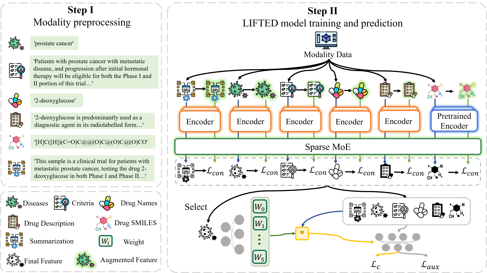

# LIFTED

This is the coder for the paper:

[Multimodal Clinical Trial Outcome Prediction with Large Language Models](https://arxiv.org/abs/2402.06512)

We propose an approach called muLti-modal mIx-of-experts For ouTcome prEDiction (LIFTED), which extracts information from different modalities with a transformer based unified encoder, enhances the extracted features by a Sparse Mixture-of-Experts framework and integrates multimodal information with Mixture-of-Experts, releasing the limitations of the extensibility to adapt new modalities and improving the ability to discern similar information patterns across different modalities.

<figure>

<figcaption align = "center">
An overview of our framework, LIFTED.
</figcaption>
</figure>

## Installation

We recommend you use `conda` to install this project and all required packages with the specific version to recurrent our experiments and results of them. The following commands can be used to install this project and all required packages.

```bash
conda env create -f requirements/conda.yml -n <env_name>
conda activate <env_name>
pip install -e .
```

See the [installation docs](docs/get_started/installation.md) for details.

## Setup

### API key

You have to set the following API keys before running experiments.

#### Wandb

We use Wandb as our logger, so you have to create an account and login with your API key before running experiments.

```bash
wandb login
### paste your api key
```

#### OpenAI API key

We use OpenAI API to generate summaries. You have to set your API key to call the ChatGPT 3.5 API.

```bash
echo <your-openai-key> > openai_api_key.txt
```

### Datasets

We put all the datasets under the `data` directory. You can create it under the root directory of this project with the following command.

```bash
mkdir data
```

#### Hint

Download the Hint dataset to the `data` directory.

```bash
git clone https://github.com/futianfan/clinical-trial-outcome-prediction.git data/clinical-trial-outcome-prediction
```

##### Criteria

Prepare the criteria data by running the following command.

```bash
python tools/datasets/encode_criteria.py
```

##### LLM output

Run the following command to generate the summarization output from the LLM model.

```bash
python tools/datasets/convert_datasets.py --tasks hint_summary
```

##### Prepared outputs

We also provide the outputs for the hint dataset. You can use them by running the following command, without generating them by yourself.

```bash
mv prepared_data/clinical-trial-outcome-prediction/* data/clinical-trial-outcome-prediction/data/
```

## Usage

### Training

You can train the model with the following command.

```bash
CUDA_VISIBLE_DEVICES=<gpu_ids> cli fit --config-file configs/path/to/config.yaml
```
where the `configs/path/to/config.yaml` is the path to the config file you want to use. For instance, run the following command to train the mmcto model with data augment and auxiliary loss features on the phase I dataset.

```bash
CUDA_VISIBLE_DEVICES=<gpu_ids> cli fit --config-file configs/runs/mmcto/base/mmcto_hint_phase_I_augment_aux-loss_1x.yaml
```

### Evaluation

You can evaluate your model trained in the previous step on validation or test dataset with the following command.

```bash
CUDA_VISIBLE_DEVICES=<gpu_ids> cli {validate, test} --config-file configs/runs/mmcto/base/mmcto_hint_phase_I_augment_aux-loss_1x.yaml --ckpt_path work_dirs/mmcto_hint_phase_I_augment_aux-loss_1x/<run_id>/checkpoints/<ckpt_name>.ckpt
```
where the `{validate, test}` determines the dataset you want to evaluate on, and the `configs/runs/mmcto/base/mmcto_hint_phase_I_augment_aux-loss_1x.yaml` is the path to the config file you want to use, and the `work_dirs/mmcto_hint_phase_I_augment_aux-loss_1x/<run_id>/checkpoints/<ckpt_name>.ckpt` is the path to the checkpoint you want to evaluate.

### Prediction

You can predict the outcome of the clinical trials and plot the weights of the Sparse Mixture-of-Experts and Mixture-of-Experts modules with the following command.

```bash
CUDA_VISIBLE_DEVICES=<gpu_ids> cli predict --config-file configs/runs/mmcto/base/mmcto_hint_phase_I_augment_aux-loss_1x.yaml --ckpt_path work_dirs/mmcto_hint_phase_I_augment_aux-loss_1x/<run_id>/checkpoints/<ckpt_name>.ckpt
```

Similarly, the `configs/runs/mmcto/base/mmcto_hint_phase_I_augment_aux-loss_1x.yaml` is the path to the config file you want to use, and the `work_dirs/mmcto_hint_phase_I_augment_aux-loss_1x/<run_id>/checkpoints/<ckpt_name>.ckpt` is the path to the checkpoint you want to predict.

## Contribution

See [contribution docs](docs/get_started/contribution.md) for details.

## Citation

If you find this repo is helpful to your research, please consider citing our paper:

```bibtex
@article{zheng2024multimodal,
  title={Multimodal Clinical Trial Outcome Prediction with Large Language Models},
  author={Zheng, Wenhao and Peng, Dongsheng and Xu, Hongxia and Zhu, Hongtu and Fu, Tianfan and Yao, Huaxiu},
  journal={arXiv preprint arXiv:2402.06512},
  year={2024}
}
```
